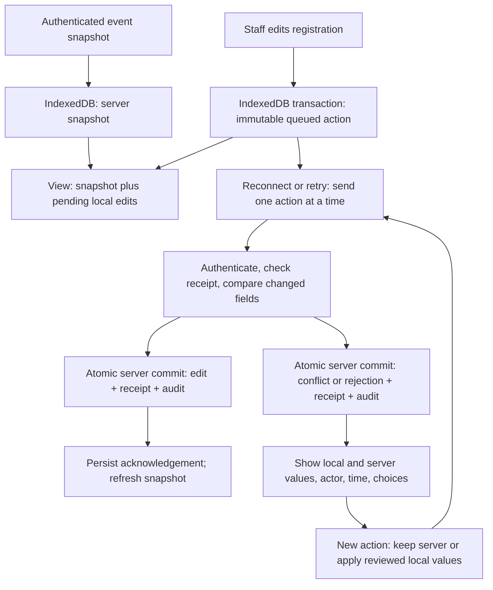

# Offline operation: architecture review and first slice

Status: first vertical slice implemented locally; architecture and implementation await review. No deployment approved.

Review scope: requirements, staff UI, backend/API boundaries, durable storage,
authentication, mobile/offline behavior, testing, data privacy, and maintenance.
The existing event aggregate remains authoritative. Browser state is a saved read
model plus explicit, unconfirmed commands, not a second authoritative database.

## Baseline before this slice

The React app polls `/events/:id/sync` and reads a consistent event, registration,
and report snapshot. It lost that snapshot on reload and blocked writes
when disconnected. The PWA worker caches some static assets but does not guarantee
that a complete build is available offline. Registration PATCH uses event revision
and registration timestamp checks. Both persistence drivers commit event aggregates;
Supabase uses `commit_event_aggregate` with a revision comparison inside its transaction.
These are useful foundations; offline writes must not bypass those checks.

## First vertical slice

Allow edits to existing registration details: names, genre, region, contact details,
Instagram, birth date, parent name, notes, and review fields. Registration creation,
check-in/payment, imports, event settings, timers, judging, and bracket operations
remain online-only in this slice. A cached event can be read and edited during an
outage; this does not yet make every event-day operation work offline.



## Data and ownership

- IndexedDB stores a versioned document for each API origin/path and signed-in staff
  identity. It contains confirmed snapshots, immutable actions, terminal results,
  and local receipt times. Read/modify/write uses one IndexedDB transaction so tabs
  cannot replace each other's queues. Event ID and mode remain in the saved snapshot.
- Each edit carries a UUID idempotency key, event/registration IDs, staff identity,
  local creation time, changed fields only, and each field's last confirmed value
  and server revision stamp. The queue is durable before “saved on this device” appears.
- Pending values are an overlay; they never replace the confirmed snapshot. Only
  one unresolved edit per registration is allowed, avoiding hidden dependent edits.
  Other registrations can still be edited or synchronized.
- The server authenticates the actor rather than trusting client-provided names.
  It compares every edited field with its captured base, including its revision
  stamp. Unrelated changes can coexist; overlapping changes (including change-away-
  and-back) require a decision. The entire edit is accepted or rejected atomically.
- A receipt keyed by action ID and a canonical payload digest is stored in the same
  event aggregate transaction as the mutation and audit. Reusing a key with another
  payload or staff identity fails. Duplicate delivery returns the original receipt.
  Receipts are retained for the event's lifetime, including backup restore; future
  compaction must preserve a durable deduplication ledger before deleting receipts.
- Field provenance is stored on each registration for new edits. Legacy fields use
  the most recent applicable edit/create/import audit entry, or explicitly
  “Unknown (legacy record)” with the record creation timestamp (or unknown time).
  No actor or time is invented.
- Each sync pass processes at most 20 actions, sequentially. Failed connection
  checks back off with jitter to at most 30 seconds. Browser online/foreground
  events and Retry sync attempt immediately. Requests time out after 12 seconds;
  a timeout never proves that a write did not commit.

## Conflict resolution

Every conflict shows field name, local value, server value, local author/time, server
author/time, and choices: keep server values, apply reviewed local values, or leave
unresolved. Applying local values creates a NEW immutable action against the displayed
server values/stamps. Another change since that comparison creates another conflict.
Keeping server values also sends an idempotent acknowledgement and audit record.
There is no force-overwrite endpoint. Rejections show their reason and remain in history.

## Failure modes and recovery

| Failure | Behavior |
| --- | --- |
| Internet disappears before send | Keep the durable action pending and its local overlay visible. |
| Server commits but response is lost | Retry the same key/payload; return the committed receipt, never apply twice. |
| One action conflicts or is rejected | Record its result; continue independent registrations. |
| Timeout, 5xx, or unknown response | Keep pending; stop the pass and retry on the next connection check. |
| Receipt saved but snapshot refresh fails | Retain the acknowledged patch until a snapshot at or beyond the receipt revision arrives. |
| Browser refreshes | Reload snapshot and queue from IndexedDB, then resume pending actions. A fresh browser session still requires online sign-in. |
| Two tabs send the same action | Server deduplicates it; IndexedDB transactions preserve other local actions. |
| Another staff member edits the same field | Show both values and provenance; require an explicit choice. |
| Registration deleted, event paused/archived, invalid edit | Persist a rejected receipt/audit where the event exists; keep a local rejection if the event is gone. |
| Session expires | Keep local data/queue; require online sign-in as the same identity before upload. Never replay as another staff member. |
| Device storage unavailable/full | Do not claim a local save; show the error and preserve the open form. |
| Old queued payload after app upgrade | Version every command; reject unsupported versions without mutation. |
| Backup restored | Preserve prior receipt ledger; a previously applied command must never silently replay. |

## Offline access and limits

The first visit and first sign-in require internet. A successfully loaded production
build is precached with its hashed JS/CSS and local fonts/brand assets. API responses
are never stored in Cache Storage. An existing browser session may reopen its scoped
IndexedDB snapshot offline, including when its token has expired; server synchronization
still requires valid authentication. Closing a session/signing out requires online
sign-in again. Sign-out hides local data but retains pending work for the same identity.
Shared-device users should clear site data after all work is synchronized. IndexedDB
is browser storage, not an encrypted backup; browser eviction or clearing site data
can remove unsynced work. Export/recovery across devices is a later slice.

This expands on-device storage of existing registration data, including contacts
and dates of birth. Use trusted staff devices; it is not appropriate for an audience
display or shared public device. The shared-code login currently identifies staff
by name and role, not a unique account ID. Queue scoping prevents accidental replay
under a different signed-in identity, but is not an access-control boundary against
someone with device access or the shared code. Unique staff accounts, retention and
remote-device revocation need a separate security increment before wider use.

No SQL migration is required for this slice: field stamps and receipts live in
the existing JSON domain snapshot and use the existing Supabase aggregate RPC.
The local JSON driver supports one server process; its read/compare/write operation
is now synchronous within that process. Supabase remains required in production.
Deploy the backend capability before the matching frontend. Do not roll back to a
backend that drops receipt ledgers during restore while any offline queues remain.

Production uses HTTPS; iPhone LAN HTTP does not provide the same PWA guarantees.
Use a previously visited HTTPS build for offline launch tests. Development server
testing alone is insufficient to verify the installed app shell.

## Incremental follow-ups

1. This slice: registration detail edits, snapshots, queue, receipts, conflict UI,
   audit, reconnect tests, and production shell caching.
2. Check-in, spectator counts, and payments: model reversible commands and money
   separately; never replay an increment as a generic document replacement.
3. Prelim/judging commands: one authority per timer/run order, per-judge score records,
   and explicit conflict policy for completion and rank changes.
4. Brackets and audience display: revisioned match decisions, dependent-action
   invalidation, local display feed, and multi-device event-day rehearsal.

Acceptance tests for this slice cover duplicate and concurrent delivery, changed-key
reuse, overlapping and unrelated edits, resolution races, provenance, partial network
failures, lost acknowledgements, reconnect/reload, authentication expiry, and storage
failure. Live Supabase/phone testing remains a separate release gate.

## Verification and review

Local verification on September 24, 2026:

- `npm run check`: passed.
- `npm test`: backend suites passed; frontend passed (35 tests across 11 files after
  the final local-name overlay check).
- `VITE_API_URL=/api npm run build`: passed; the service worker precaches 13 build files.
- Production Chromium integration: passed with an isolated local JSON event and
  real IndexedDB/service-worker storage. No live event data was used.
- Desktop and 390px screenshots reviewed. The check-in layout now uses available
  container width so the activity rail cannot clip the pending-edit warning.
- Staging Supabase integration could not start: `SUPABASE_TEST_URL` and
  `SUPABASE_TEST_SECRET_KEY` were not configured. No remote database was modified.

- Backend HTTP tests use isolated temporary data: duplicate/concurrent delivery,
  persisted receipt replay, backup restoration, key/identity reuse, unrelated edits,
  conflicting values/provenance, resolution races, online PATCH stamps, ABA changes,
  durable validation/lifecycle rejection, and atomic local persistence.
- Frontend tests cover queue reload/reconnect, lost responses, failed receipt writes,
  partial batches, independent actions after conflict, immutable resolution commands,
  storage failure, identity/API/event isolation, expired authentication, permanent
  rejection, and no additional edit before a refreshed acknowledgement snapshot.
- The production-browser test exercises real IndexedDB and the service worker:
  offline edit and reload, a second staff member's edit, visible conflict resolution,
  reconnect, a deliberately lost server response, and a simulated storage quota error.
  It also checks a 390px viewport and captures desktop/mobile screenshots.

Run `npm run check`, `npm test`, and `npm run build`. For the browser test, use an
existing Playwright/Chrome installation (no installation is performed by the test):

```sh
VITE_API_URL=/api npm run build
MENYU_PLAYWRIGHT_MODULE=/absolute/path/to/playwright node tools/offline-browser-test.cjs
```

Before release, test an actual iPhone over HTTPS with airplane mode, Safari/PWA
termination and relaunch, expired session, low storage, and two staff devices against
staging Supabase. Those checks and push/deployment still require approval. This slice
does not yet guarantee a fully offline event or background sync while iOS suspends it.
